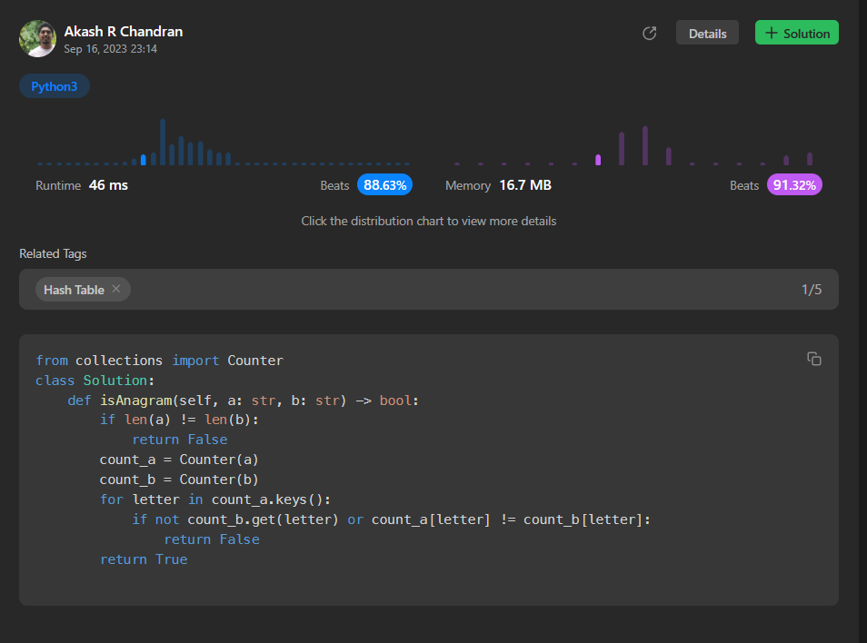

# [2. Valid Anagram](https://leetcode.com/problems/valid-anagram/)

## Intuition
The code appears to be an implementation of a solution to the "Valid Anagram" problem. The intuition behind this solution is not provided in the code itself, so we'll need to infer it from the code.

The code compares two strings, `a` and `b`, and determines whether they are anagrams of each other. An anagram is a word or phrase formed by rearranging the letters of another. In this case, it checks if the two input strings have the same set of characters with the same frequency.

## Approach
The code follows a straightforward approach to solving the problem. It first checks if the lengths of the two input strings, `a` and `b`, are not equal. If their lengths are not the same, it returns `False` because two strings with different lengths cannot be anagrams.

If the lengths are equal, the code proceeds to create counters for both strings, `count_a` and `count_b`, using the `collections.Counter` function. This allows the code to count the frequency of each character in both strings.

Then, it iterates through the keys in `count_a` (the characters in string `a`) and checks if the same character exists in `count_b` (string `b`) and whether their counts match. If any character's count doesn't match between the two strings, it returns `False`.

If the code doesn't encounter any mismatch in counts for characters, it returns `True`, indicating that the input strings are valid anagrams.

## Complexity
- Time complexity:
The time complexity of this solution can be analyzed as follows:
  - The initial length check for strings `a` and `b` is done in constant time, O(1).
  - Creating the counters for `a` and `b` using `collections.Counter` is done in O(n) time, where n is the length of the input strings.
  - The subsequent loop iterates through the keys in the `count_a` dictionary, which has a maximum of 26 keys (for lowercase English alphabet characters). Hence, it can be considered O(1).
  - Within the loop, checking the existence of a character in `count_b` and comparing counts are also O(1) operations.
  
> As a result, the overall time complexity is O(n), where n is the length of the input strings.

- Space complexity:
The space complexity is determined by the space used to store the `count_a` and `count_b` dictionaries. Since these dictionaries store character counts, the space complexity is O(1) because the number of unique characters is limited to the English alphabet (26 characters).
## Code
```
from collections import Counter
class Solution:
    def isAnagram(self, a: str, b: str) -> bool:
        if len(a) != len(b):
            return False
        count_a = Counter(a)
        count_b = Counter(b)
        for letter in count_a.keys():
            if not count_b.get(letter) or count_a[letter] != count_b[letter]:
                return False
        return True
```
## Runtime



## Leetcode Solution Post Link
> [Python](https://leetcode.com/problems/valid-anagram/solutions/4221986/simple-python-solution-beats-88-63-using-hashmap/)