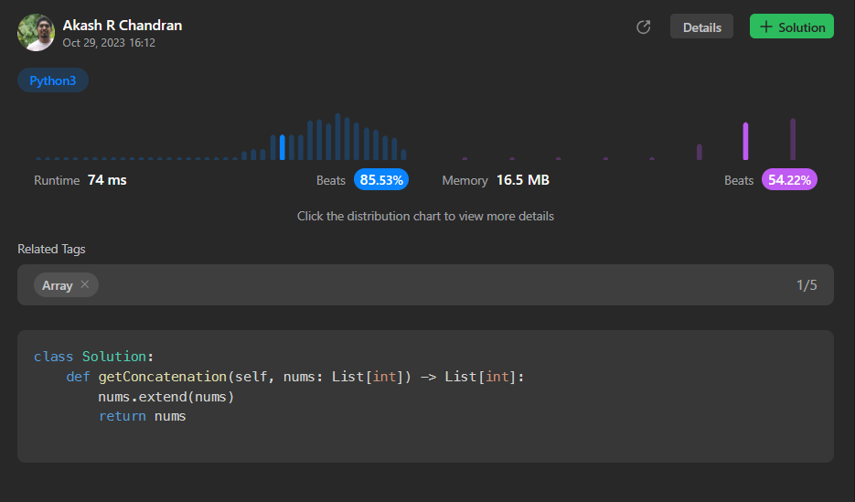

# [3. Concatenation of Array](https://leetcode.com/problems/concatenation-of-array/)

## Intuition
The intuition behind solving this problem is to concatenate the given list with itself. This means we will simply append the elements of the list to itself, creating a new list that is a concatenation of the original list with itself.

## Approach
To implement this approach, we will extend the original list with a copy of itself. This can be done by using the `extend` method available for Python lists. The `extend` method takes an iterable (in this case, the original list) and appends its elements to the end of the list.

## Complexity
- Time complexity:The time complexity of this approach is O(n), where n is the length of the input list `nums`. The `extend` operation takes linear time.

- Space complexity:The space complexity is also O(n), as we are creating a new list of the same length as the input list.

## Code
```
class Solution:
    def getConcatenation(self, nums: List[int]) -> List[int]:
        nums.extend(nums)
        return nums     
```


## Runtime



## Leetcode Solution Post Link
> [Python](https://leetcode.com/problems/concatenation-of-array/solutions/4222111/simple-python-solution-beats-85-53/)