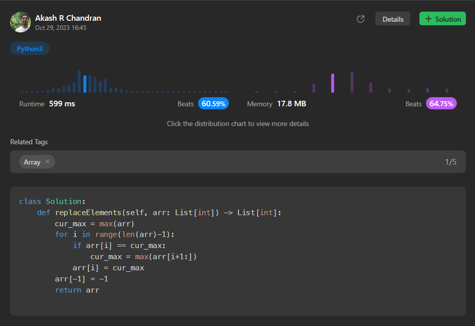

# [4. Replace Elements With Greatest Element On Right Side](https://leetcode.com/problems/replace-elements-with-greatest-element-on-right-side/)

## Intuition
The intuition for solving this problem is to find the maximum element to the right of each element in the array and replace each element with this maximum element.

## Approach
- Start by initializing `cur_max` to the maximum value in the given array `arr`.
- Iterate through the array from left to right, except for the last element, using a for loop.
- In each iteration, check if the current element is equal to `cur_max`. If it is, update `cur_max` to be the maximum value in the subarray to the right of the current element.
- Replace the current element with `cur_max`.
- Finally, set the last element of the array to -1 since there are no elements to its right.
- Return the modified array as the result.

## Complexity
- Time complexity: O(n) where n is the length of the input array `arr`. We iterate through the array once.
- Space complexity: O(1) because we use a constant amount of extra space to store `cur_max`.

## Code
```
class Solution:
    def replaceElements(self, arr: List[int]) -> List[int]:
        cur_max = max(arr)
        for i in range(len(arr)-1):
            if arr[i] == cur_max:
                cur_max = max(arr[i+1:])
            arr[i] = cur_max
        arr[-1] = -1
        return arr
```

## Runtime



## Leetcode Solution Post Link
> [Python](https://leetcode.com/problems/replace-elements-with-greatest-element-on-right-side/solutions/4222184/python-optimised-solution-beats-60-59/)