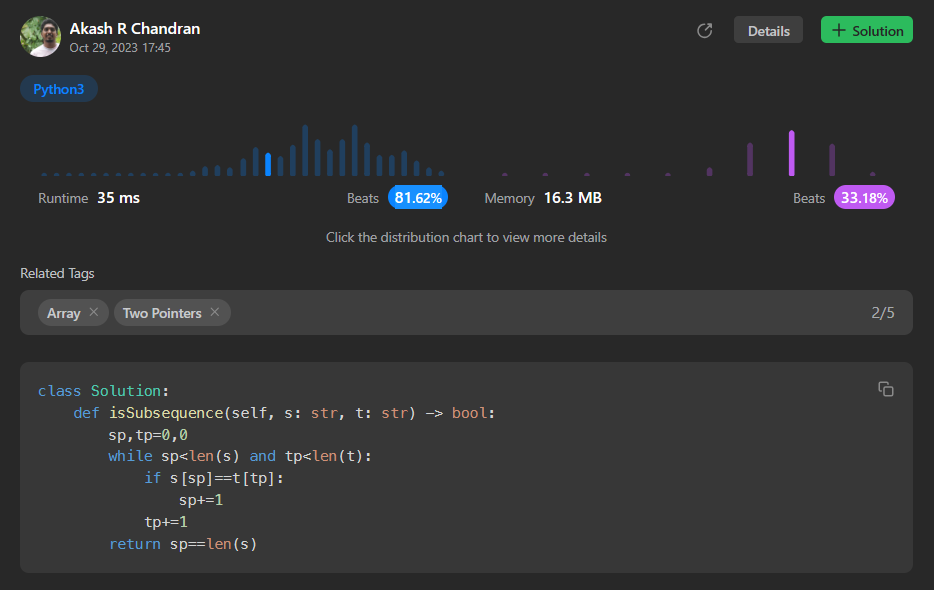

# [Is Subsequence](https://leetcode.com/problems/is-subsequence/)

## Intuition
The problem requires checking if string `s` is a subsequence of string `t`. To solve this, we can iterate through both strings, comparing characters. If we find a match, we move to the next character in both strings. If we successfully iterate through all characters in `s`, it means `s` is a subsequence of `t`.

## Approach
The approach to solving this problem is quite straightforward. We maintain two pointers, `sp` for string `s` and `tp` for string `t`. We iterate through both strings, comparing characters at the current positions. If there is a match, we move the `sp` pointer to the next character in `s`. In any case, we move the `tp` pointer to the next character in `t`. We continue this process until we have either matched all characters in `s`, in which case we return True, or we reach the end of `t`, in which case we return False.

## Complexity
- Time complexity: The time complexity of this solution is O(m), where m is the length of string `t`. We iterate through `t` once, and the time taken is proportional to the length of `t`.
- Space complexity: The space complexity is O(1) because we only use a constant amount of extra space to store the pointers and variables.

## Code
```python
class Solution:
    def isSubsequence(self, s: str, t: str) -> bool:
        sp,tp=0,0
        while sp<len(s) and tp<len(t):
            if s[sp]==t[tp]:
                sp+=1
            tp+=1
        return sp==len(s)
```  

## Runtime



## Leetcode Solution Post Link
> [Python](https://leetcode.com/problems/is-subsequence/solutions/4222381/two-pointer-solution-beats-81-62/)