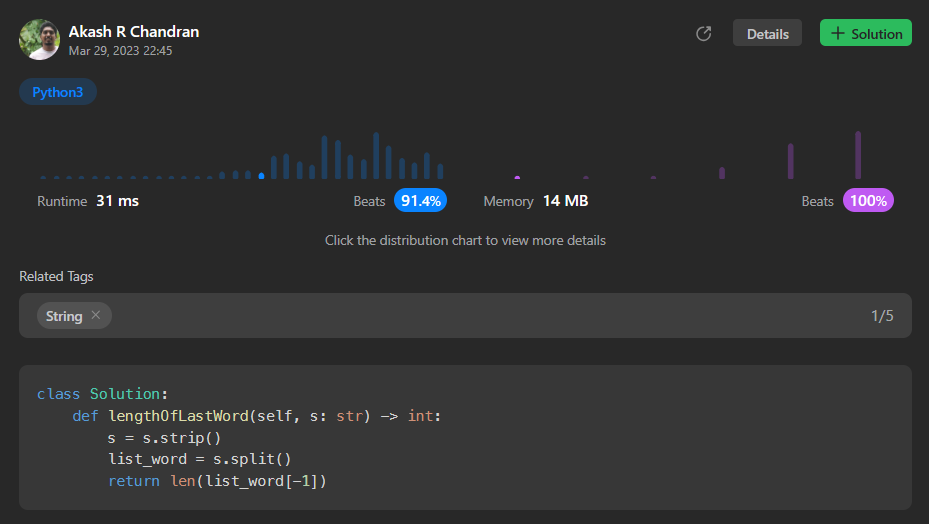

# [6. Length of Last Word](https://leetcode.com/problems/length-of-last-word/)

# Intuition
The problem asks for the length of the last word in a given string. To solve this, we can start by removing any leading and trailing spaces from the input string. Then, we split the cleaned string by spaces to get a list of words, and the last element in the list will be the last word. Finally, we return the length of the last word.

# Approach
1. Use the `strip()` method to remove leading and trailing spaces from the input string `s`.
2. Split the cleaned string into a list of words using the `split()` method, which splits the string on spaces.
3. Get the last word from the list by accessing `list_word[-1]`.
4. Return the length of the last word using the `len()` function.

# Complexity
- Time complexity: The time complexity is primarily determined by the `strip()` and `split()` operations, both of which have a time complexity of O(n), where n is the length of the input string. The subsequent length calculation is constant time. Therefore, the overall time complexity is O(n).
- Space complexity: The space complexity is determined by the storage of the cleaned string and the list of words, both of which require additional memory proportional to the length of the input string. Therefore, the overall space complexity is O(n).

# Code
```python
class Solution:
    def lengthOfLastWord(self, s: str) -> int:
        s = s.strip()
        list_word = s.split()
        return len(list_word[-1])
```

## Runtime



## Leetcode Solution Post Link
> [Python](https://leetcode.com/problems/length-of-last-word/solutions/4222851/easy-python-solution-beats-91-4/)