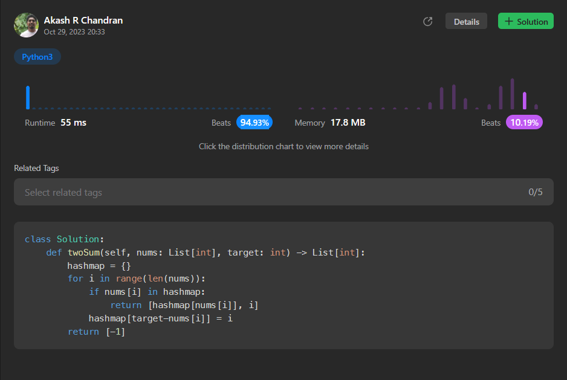

# [7. Two Sum](https://leetcode.com/problems/two-sum/)

## Intuition
The problem seems to be asking for a solution to find two numbers in an array that add up to a given target. A common approach to solve this problem is by using a hash map (dictionary in Python). We can iterate through the array, keeping track of elements we've seen so far and their indices, and check if the complement of the current number (i.e., `target - nums[i]`) is already in the hashmap. If it is, we found a pair that adds up to the target.

## Approach
1. Initialize an empty hashmap to store elements and their indices.
2. Iterate through the input list `nums` using a for loop.
3. For each element `nums[i]`, calculate its complement, which is `target - nums[i]`.
4. Check if the complement is already in the hashmap.
   - If it is, return the indices of the complement and the current element as a list.
      - If it's not in the hashmap, add the current element to the hashmap with its index as the value.
5. If no valid pair is found in the loop, return `[-1]` to indicate that no solution exists.

## Complexity
- Time complexity: `O(n)` - We iterate through the array once, and each lookup or insertion in the hashmap takes constant time.
- Space complexity: `O(n)` - In the worst case, we might need to store all `n` elements in the hashmap.
## Code
```python3
class Solution:
    def twoSum(self, nums: List[int], target: int) -> List[int]:
        hashmap = {}
        for i in range(len(nums)):
            if nums[i] in hashmap:
                return [hashmap[nums[i]], i]
            hashmap[target-nums[i]] = i
        return [-1]
```


## Runtime



## Leetcode Solution Post Link
> [Python](https://leetcode.com/problems/two-sum/solutions/4222916/easy-python-hashmap-solution-beats-94-93/)