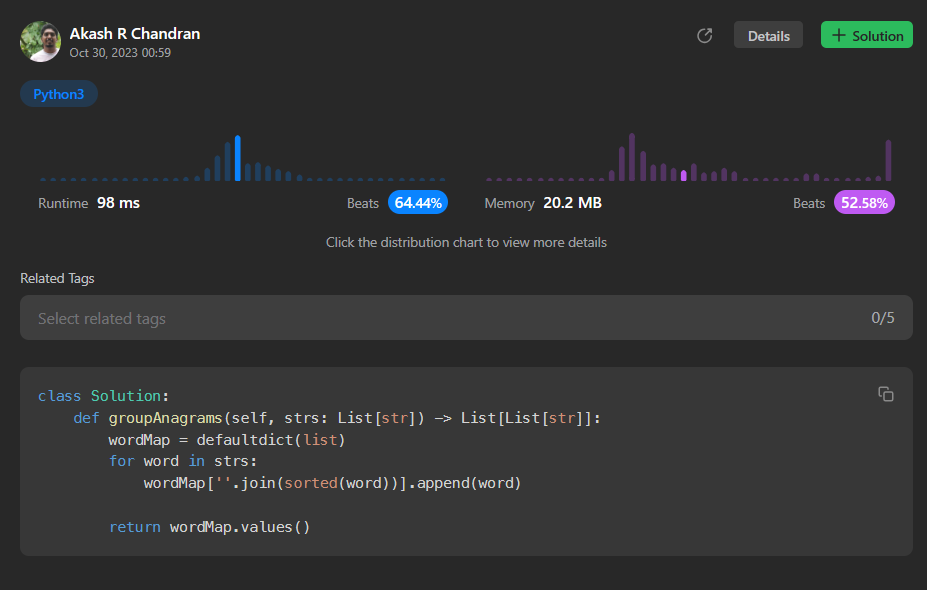

# [9. Group Anagrams](https://leetcode.com/problems/group-anagrams/)

## Intuition
The problem involves grouping anagrams together from a given list of words. Anagrams are words that have the same characters but in a different order. To solve this, we can use a hash table (dictionary) to group anagrams together efficiently. The idea is to sort each word and use the sorted version as a key in the dictionary to store all anagrams of that sorted word.

## Approach
1. Create an empty dictionary called `wordMap`, which will be used to group anagrams.
2. Iterate through each word in the input list `strs`.
3. Sort the characters of the word to get the canonical representation of the word.
4. Use the sorted word as a key in the `wordMap` dictionary and append the original word to the list associated with that key.
5. After processing all words, the `wordMap` dictionary will contain lists of anagrams, grouped by their canonical representation.
6. Return the values of the `wordMap` dictionary as the final result.

## Complexity
- Time complexity: O(n * k * log(k)) where n is the number of words in the input list and k is the maximum length of a word in the list. This is because we are sorting each word, and the sorting operation takes O(k * log(k)) time.
- Space complexity: O(n * k), where n is the number of words in the input list, and k is the maximum length of a word in the list. This is because we are storing the sorted words in the `wordMap` dictionary.

## Code
```python
class Solution:
    def groupAnagrams(self, strs: List[str]) -> List[List[str]]:
        wordMap = defaultdict(list)
        for word in strs:
            wordMap[''.join(sorted(word))].append(word)

        return wordMap.values()
```

## Runtime



## Leetcode Solution Post Link
> [Python](https://leetcode.com/problems/group-anagrams/solutions/4226667/easy-to-understand-python-solution-beats-64-44/)